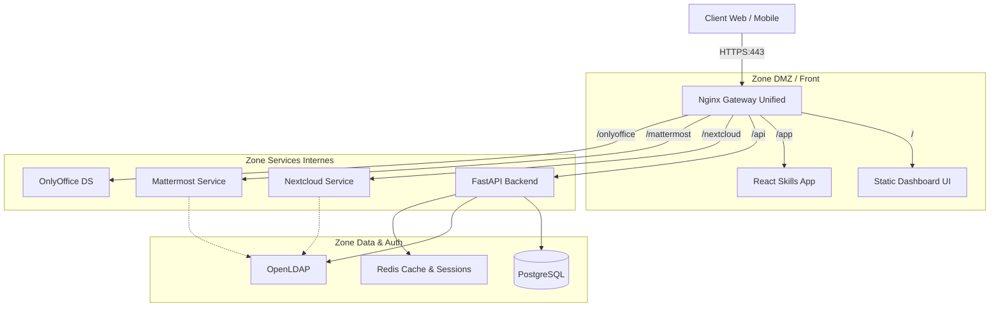

# Architecture Cible Backend : Portail Unifié & Services

**Version :** 2.0 (Target)
**Date :** 11 Janvier 2026
**Statut :** Spécification Technique

## 1. Vue d'Ensemble

L'objectif est de transformer l'architecture actuelle (services isolés) en une plateforme unifiée accessible via un point d'entrée unique (Gateway).

### Schéma de Principe



---

## 2. Gateway Unifiée (Nginx)

Le composant central de la nouvelle architecture est le Reverse Proxy Nginx configuré comme Gateway.

### Responsabilités :
1.  **Terminaison SSL :** Gère les certificats (Let's Encrypt ou Custom Univ).
2.  **Routing par Path :**
    *   `/` -> Dashboard (Landing Page)
    *   `/app` -> Application Principale (Skills Hub)
    *   `/api` -> Backend API
    *   `/nextcloud` -> Nextcloud
    *   `/mattermost` -> Mattermost
3.  **Injection d'En-têtes de Sécurité :** HSTS, CSP, X-Frame-Options.

### Configuration Cible (Extrait) :
```nginx
location /nextcloud {
    proxy_pass http://nextcloud:80;
    proxy_set_header Host $host;
    proxy_set_header X-Real-IP $remote_addr;
    # ... configurations WebDAV nécessaires
}
```

---

## 3. Stratégie d'Authentification (SSO)

Pour garantir une expérience fluide ("Log in once, access everything"), nous mettrons en place un flux SSO hybride.

### Le Flux "Session Partagée" (Approche Pragmatique)
Étant donné que tous les services sont sur le même domaine (`projet-edu.eu`), nous utiliserons un cookie de session sécurisé partagé ou un mécanisme de "Token Propagation".

1.  **Login Central :** L'utilisateur se connecte sur le Dashboard (`/login`).
2.  **Validation :** L'API valide les credentials contre LDAP.
3.  **Émission Token :** L'API génère un JWT (`access_token`) stocké en Cookie `HttpOnly; Secure; SameSite=Strict`.
4.  **Accès API & App :** Le cookie authentifie automatiquement les requêtes vers `/api` et `/app`.
5.  **Accès Nextcloud/Mattermost :**
    *   *Option A (Idéale) :* Configuration SAML/OIDC sur Nextcloud pointant vers un Identity Provider (Keycloak ? Trop lourd ?).
    *   *Option B (Pragmatique) :* "Pre-authentication" via Headers HTTP injectés par Nginx (si module auth_request utilisé) ou maintien de sessions séparées mais synchronisées (via CAS Univ si disponible).
    *   *Décision pour Sprint 1 :* Utiliser l'auth CAS de l'université si possible, sinon rester sur des sessions isolées mais avec des liens profonds (Deep Links) facilités.

---

## 4. Nouveaux Services Backend

### 4.1 Service Proxy WebDAV
Pour permettre l'upload mobile sans friction :
*   **Endpoint :** `POST /api/storage/upload`
*   **Logique :** Le backend reçoit le fichier, instancie un client WebDAV (avec un compte système "Service Account" ou en impersonnalisant l'utilisateur), et stream le fichier vers Nextcloud.
*   **Avantage :** Le frontend ne connaît jamais les détails de connexion Nextcloud.

### 4.2 Service "Magic Links" (Tuteurs)
Pour l'évaluation externe :
*   **Modèle de Données :**
    ```python
    class EvaluationToken(SQLModel, table=True):
        id: uuid.UUID = Field(default_factory=uuid.uuid4, primary_key=True)
        student_id: int
        tutor_email: str
        skill_id: str
        expires_at: datetime
        is_used: bool = False
    ```
*   **Endpoint Public :** `GET /api/public/evaluation/{token}` (Sans Auth requise, validé par le token).

---

## 5. Évolution du Modèle de Données (PostgreSQL)

### Table `User` étendue
Ajout des champs pour le RBAC :
*   `role`: Enum (`SUPER_ADMIN`, `DEPT_ADMIN`, `TEACHER`, `STUDENT`, `EXTERNAL`)
*   `department_id`: Pour le multi-tenant.

### Table `ResponsibilityMatrix`
Pour lier profs et activités :
*   `id`: PK
*   `user_id`: FK -> User
*   `activity_type`: Enum (`SAE`, `INTERNSHIP`, `COURSE`)
*   `activity_id`: ID de l'activité
*   `is_owner`: Bool (True = Responsable validateur, False = Intervenant)

---

## 6. Infrastructure & Déploiement

### Gestion du Serveur "Isolé" (Interne Univ)
*   **Certificats SSL :** Utilisation d'un script d'import manuel (`import-certs.sh`) qui place les `.crt` et `.key` dans le volume monté de Nginx.
*   **Déploiement Offline-Ready :** Images Docker sauvegardées en `.tar` si besoin, ou pull depuis un registre interne si disponible.

---

## Conclusion
Cette architecture cible résout les problèmes de fragmentation actuels et pose les bases solides pour les fonctionnalités avancées (Tuteurs, Mobile Upload).
