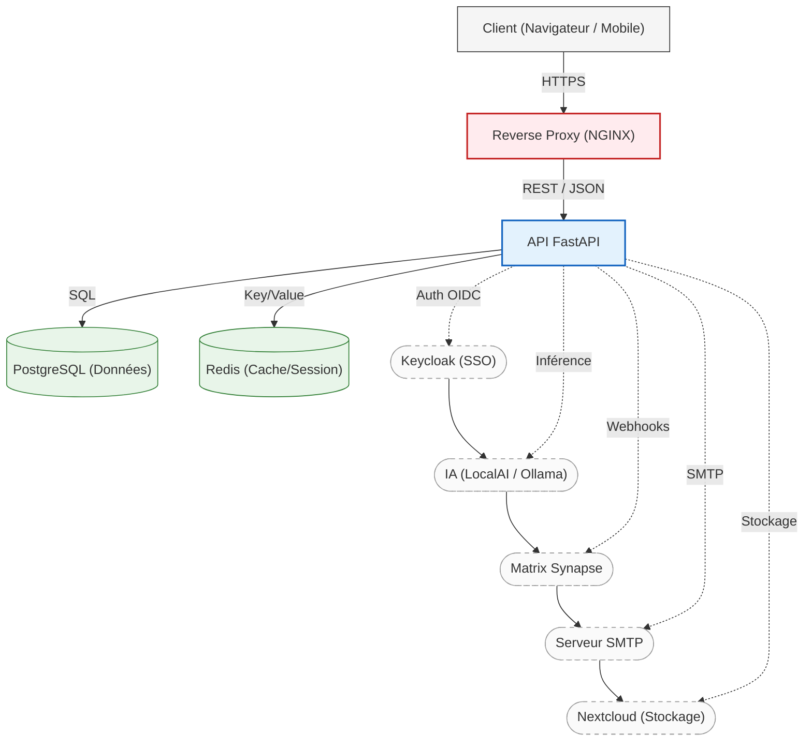

# Documentation Technique - Skills Hub Remaster

*Ce document est destiné aux équipes de la DSI pour la compréhension architecturale et le provisionnement des ressources (VM) nécessaires au déploiement.*

---

## 1. Architecture Globale et Infrastructure

L'application **Skills Hub Remaster** est conçue pour fonctionner comme un point central d'orchestration, s'interfaçant avec plusieurs services institutionnels existants.

### 1.1 Schéma d'Architecture



### 1.2 Interactions avec les systèmes tiers
- **Keycloak** : Gère l'authentification centrale et le lien avec le LDAP de l'université. Le Skills Hub ne stocke aucun mot de passe.
- **Serveur IA** : Un serveur de laboratoire externe (déjà existant) est interrogé via des requêtes HTTP (OpenAI-compatible) pour l'assistance pédagogique.
- **Serveur Matrix (Element)** : Création dynamique de salons de discussion pour le suivi de stage (Enseignant / Étudiant / Tuteur).
- **Stockage** : Les fichiers lourds (documents, preuves d'activités) ont vocation à être stockés sur un stockage externe sécurisé (serveur de fichier ou S3).

---

## 2. Prérequis d'Hébergement (Recommandations DSI)

L'application backend est légère et asynchrone (FastAPI/Python), et une grande partie de la charge de calcul (IA, Stockage) est déportée sur des serveurs existants.

### 2.1 Spécifications de la Machine Virtuelle (VM)
Pour un usage standard ciblant un département IUT (quelques centaines d'utilisateurs concurrents) :

- **CPU** : 2 à 4 vCPU (FastAPI est très performant avec Uvicorn et plusieurs workers).
- **RAM** : 4 Go à 8 Go (Largement suffisant pour l'application Python, PostgreSQL et Redis).
- **Stockage** :
  - Système & OS : 30 Go.
  - Base de données locale (PostgreSQL) : 20 Go (Les données sont principalement du texte JSON et des notes).
  - *Note : Le stockage des fichiers lourds n'est pas géré sur cette VM.*
- **OS Recommandé** : Debian 12 ou Ubuntu 22.04 LTS.
- **Réseau** :
  - Port 80/443 (Web).
  - Sortie HTTP/HTTPS vers le serveur IA, Keycloak et Matrix.
  - Sortie SMTP (Port 587 ou 465) pour l'envoi des Magic Links.

---

## 3. Architecture Logicielle (Clean Architecture)

Le backend de l'application a été refondu pour suivre les principes de la **Clean Architecture** (ou Architecture Hexagonale), visant à séparer clairement les responsabilités et à rendre le code testable et maintenable.

La structure des dossiers est la suivante :

```text
backend/app/
├── api/             # Couche Présentation (Contrôleurs, Endpoints FastAPI)
├── application/     # Couche Application (Cas d'utilisation / Use Cases, Interfaces)
├── core/            # Couche Configuration (Initialisation, Settings, Middlewares)
├── infrastructure/  # Couche Infrastructure (Base de données, Services externes)
└── models/          # Couche Domaine (Modèles SQLModel/Pydantic purs)
```

### 3.1 Couche Domaine (`app/models/`)
Contient les entités métier pures. Le monolithe `models.py` a été divisé par domaine :
- `user.py` : Utilisateurs et Groupes.
- `curriculum.py` : Compétences, Composantes Essentielles, Apprentissages Critiques, Ressources.
- `activity.py` : SAÉs, Projets, Stages.
- `internship.py` : Dossiers de stage, Entreprises.
- `evaluations.py` : Grilles d'évaluation, Résultats, Magic Links.

### 3.2 Couche Application (`app/application/`)
Orchestre la logique métier.
- **Use Cases** : Classes contenant la logique spécifique (ex: `SubmitInternshipApplicationUseCase`).
- **Interfaces** : Définition des contrats pour les services externes (ex: `PdfGeneratorInterface`, `SmtpServiceInterface`), garantissant un découplage fort.

### 3.3 Couche Infrastructure (`app/infrastructure/`)
Implémente les interfaces définies par la couche application :
- `database.py` : Configuration SQLAlchemy/SQLModel.
- `services/` : Implémentations concrètes (ex: `ReportLabPdfGenerator` pour la génération de PDF, `MatrixService` pour la communication avec le serveur Element).

### 3.4 Couche API (`app/api/`)
Points d'entrée de l'application (API REST). Expose les routes pour l'authentification (`auth.py`) et la génération de fiches (`fiches.py`). Un routeur séparé (`app/routers/mobile.py`) est dédié aux vues mobiles avec un rendu côté serveur via Jinja2.

---

## 4. Gestion des Données Personnelles (RGPD)

Le Skills Hub manipule des données d'étudiants, d'enseignants et de tuteurs professionnels. Les principes suivants s'appliquent :

### 4.1 Minimisation des données
- Les comptes internes (étudiants, enseignants) sont gérés via un SSO (Keycloak / LDAP de l'Université). Le backend ne stocke que l'`uid` LDAP, le nom complet et l'adresse email. **Aucun mot de passe n'est stocké dans la base locale.**
- Pour les tuteurs externes, seuls le nom, l'email et un numéro de téléphone facultatif sont conservés pour les besoins de l'évaluation de stage.

### 4.2 Transparence et Droits des utilisateurs
- (À implémenter) Une fonctionnalité d'export de profil doit permettre à l'utilisateur de télécharger toutes les données liées à son `uid` (évaluations, traces, messages).
- Droit à l'oubli : Les données d'évaluation étant liées au parcours académique, une politique de conservation (ex: anonymisation après l'obtention du diplôme) devra être configurée selon la charte de l'université.

### 4.3 Sécurité
- L'authentification est déléguée au SSO Keycloak (OIDC).
- Les "Magic Links" envoyés aux tuteurs utilisent un token UUID unique, généré de manière aléatoire et invalidé après la période d'évaluation.
- (En production) Tous les échanges transitent via HTTPS.

---

## 5. Procédure d'Installation et Mise à jour

### 5.1 Installation Initiale
Un script d'installation interactif (`install.py`) est fourni à la racine du projet.

1. **Cloner le dépôt** sur le serveur cible.
2. **Exécuter le wizard d'installation** :
   ```bash
   python3 install.py
   ```
   Ce script vous demandera de configurer :
   - Le domaine principal (ex: `educ-ai.fr`)
   - L'URL de la base de données PostgreSQL.
   - Les identifiants Keycloak (URL, Realm, Client ID, Secret).
   - Les paramètres du serveur IA Local (Endpoint, Nom du Modèle).
   - La configuration SMTP pour l'envoi des Magic Links.
3. Le script effectue des tests de connexion (non-bloquants) et génère un fichier `.env`.
4. **Lancer l'infrastructure Docker** :
   ```bash
   docker-compose up -d
   ```

### 5.2 Mise à jour
Pour mettre à jour l'application :
1. Récupérer la dernière version du code : `git pull origin main`.
2. Reconstruire les images Docker : `docker-compose build`.
3. Relancer les conteneurs : `docker-compose up -d`.
4. (Si des changements de modèle SQLModel ont eu lieu), les migrations automatiques via Alembic devront être appliquées (actuellement, la base est synchronisée via `SQLModel.metadata.create_all` au démarrage).

---

## 6. Sauvegarde et Restauration

### 6.1 Sauvegarde
La base de données principale (PostgreSQL) contient toute la valeur métier (évaluations, référentiels, mapping). L'infrastructure globale reposant sur Docker, seul ce volume nécessite une politique de sauvegarde stricte.

Pour créer une sauvegarde (dump SQL) :
```bash
docker exec -t <nom_du_conteneur_postgres> pg_dump -c -U app_user skills_db > backup_db_$(date +%Y%m%d).sql
```
*Note : Il est recommandé de planifier cette commande via une tâche `cron` quotidienne et de l'exporter vers un stockage sécurisé (NAS/S3) distant.*

### 6.2 Restauration
En cas de sinistre, pour restaurer un dump SQL dans le conteneur actif :
```bash
cat backup_db_YYYYMMDD.sql | docker exec -i <nom_du_conteneur_postgres> psql -U app_user -d skills_db
```
*Attention : Cette opération écrasera l'état actuel de la base de données. Il est conseillé de suspendre l'API (`docker-compose stop api`) pendant l'opération.*
